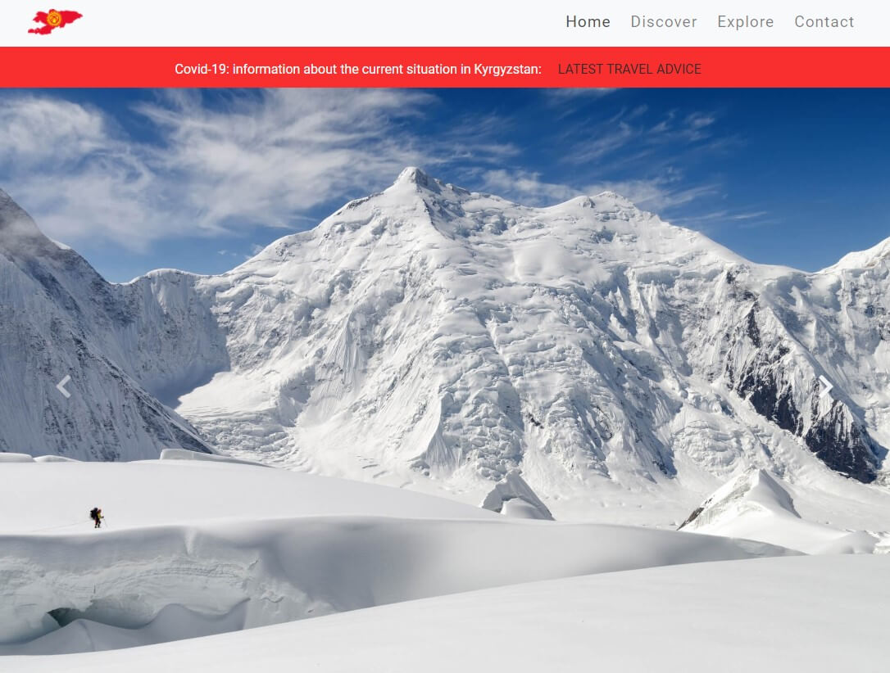
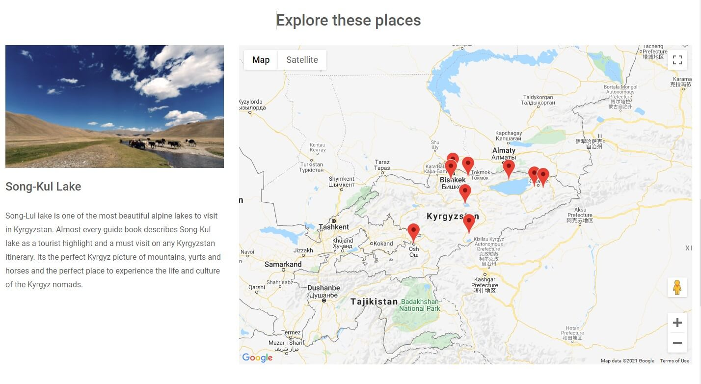

# Visit Kyrgyzstan
___
___

## Demo 
Live Demo [here :point_left:](https://nazulka.github.io/MS2-Visit-Kyrgyzstan/)
____
## About
___
This website aims to promote and advance Kyrgyzstan as a travel destination on the international market.
It communicates the diverse appeal of the country: it's authenticity, natural beauty and unique nomadic culture 
and provides users with the necessary inspiration to start planning a visit for next summer!

### Table of contents
___
  * [About](#about)
  * [UX](#ux)   
  * [Strategy](#strategy)
  * [Scope](#scope)
  * [Structure](#structure)
  * [Skeleton](#skeleton)
  * [Surface](#surface)
  * [Technologies Used](#technologies-used)  
  * [Features](#features)    
  * [Testing](#testing)
  * [Deployment](#deployment)
  * [Credits](#credits)
  * [Acknowledgements](#acknowledgements)

## UX
___
___
### **This website will appeal to:**
___
* **People with no travel plans in mind (yet) or deciding where to go:**
    * I want to get inspiration for my next travel exerience.
    * I want to be able to understand what kind of travel experience I am being offered and explore it from the comfort of my own home.    
    * I want to read more about the topics that I'm interested in.   
    * I want to use interactive elements of the website.

* **People making their first or secondary bookings**
    * I want to find out more information on situation with Covid-19 in Kyrgyzstan.
    * I can use the easily accessible simple navigation bar to select the section of the website that I need.
    * I want to see beautiful images of new locations I could visit in the future.
    * I want to find out when is the best time to visit Kyrgyzstan.   
    * I want to have access to all necessary travel information I need to plan my trip.
    * I can click the featured call to action button to receive a newsletter with travel insights and updates.

* **People who are travelling in the area**
    * I want to to use the map to find exiting places to visit locally and make quick decisions what places to visit.
    * I want to use Social Media websites for more inspiration.
    * I want to get in touch if I have any questions or queries.

     

### Strategy
___
**Project goals:**
* To provide a virtual experience to explore Kyrgyzstan to all potential travellers.
* To promote and convey the essence of the country.
* To enable easy access to the information needed to plan their trip.
* To showcase the best places to visit.
* To ensure users are able to get in touch directly from the website via the Contact Form.

### Scope
___
To create a website that ensures continuous, intuitive and fluid experience for the users. 
The content is split into small chunks that are clean and comprehensible to help users to plan their next trip.

### Structure
___
This website is a single page website that consists of four sections: Home, Discover, Explore and Contact.
To navigate to different destinations on the website, users need to click navigation links that allow them to jump to different 
sections of the content or scroll down the page.

### Skeleton 
___
* [Desktop wireframes](assets/wireframes/MS2-desktop.png)
* [Tablet and mobile wireframes](assets/wireframes/MS2-tablet-mobile.png)

### Surface
___
Simple white background, minimalist design, easily accessible navigation bar, together with stunning images of must-see places were selected to allow users to 
explore the destination from their computers, whether they are looking for a guide to a specific location or just browsing for the next trip inspiration.

## Technologies Used 
___
___
### Languages Used
___
* HTML5
* CSS3
* JavaScript

### Frameworks, Libraries and Programs Used
___

* **[Bootstrap v4.5.3](https://getbootstrap.com/docs/4.5/getting-started/introduction/)** - used to create a layout and to build a responsive, mobile-first design, 
which is compatible with all modern browsers. The components used: navigation, buttons, cards and image-carousel. 
* **jQuery and Popper.js** plugins - required to ensure proper rendering of the Bootstrap components listed above.  
* **Git** - used for version control and to keep track of the changes made to the repository.
* **Gitpod** - open source development platform, allowed me to add, commit and push files to GitHub.
* **GitHub** - used as a hosting service for version control and future collaborations.
* **Balsamiq** - to create a mockup to allow me to plan the layout and content of the website.
* **[Tinypng.com](https://tinypng.com/)** - to compress and optimise the images used for this website.
* **[Font awesome](https://fontawesome.com/)** - to add Font Awesome icons to the footer section.
* **[Adobe Photoshop Express](https://photoshop.adobe.com/)** - to resize some of the images used for the map section of the website.
* **Google Fonts** - Roboto font has been used throughout the website.
* **Google maps API** - used to embed Google Maps into the website, to provide users with the locations information.
* **EmailJS API** - to create an email template and enable users to send emails directly without using the server.
* **SweetAlert2** - an interactive custom modal window, provides a status confirmation (success / fail) when users submit a form on the website.

## Features
___
___
### Existing Features
___

* **Header**
    * Header - responsive navigation header, designed using Bootstrap "navbar" and "fixed-top" and "navbar-light" classes.  
    It is positioned on top of the page and always visible. This allows easy navigation if users wish to jump to a different section of the website. 
    * Navigation bar includes a brand logo and links to the four sections of the website: Home, Discover, Explore and Contact.
    * Navigation links are collapsed in small screen sizes into a hamburger menu and from medium size screens and larger, expand into a full size menu bar.
    * Brand logo serves as a Home page link, in addition to the Home link in the navbar. It is particularly convinient for users accessing the website on smaller screen devices to get 
    back to the Home page without having to use the hamburger menu.
    * All navigation links change color to dark grey (#4E4E4E) on hover and the current page's link stays "active", so the users can easily identify the page they are on.

* **Home**
    * A temporary Covid alert banner has been added to the top of the Home Page, to help users to find out latest information on the situation in Kyrgyzstan as 
    soon as they land on the website. "Latest travel advice" - serves as a link and takes users to GOV.UK website's Kyrgyzstan travel advice page, which opens up in a tew tab.
    The red background color has been chosen to highlight the importance of the section and to draw users' attention. 
    * Home page consists of a Bootstrap image carousel that cycles through a series of images showcasing the natural beauty of Kyrgyzstan.
    The image carousel allows 5 seconds delay between automatically cycling the images and includes previous / next controls for users' convenience. 

* **Discover**
    * This page consists of a heading, a text paragraph and Bootstrap 3 column cards section. 
    Heading - is an HTML h1 element, that also serves as a title for the whole website. It is followed by a text section and three column (on medium and larger screen sizes) Bootstrap card section. 
    On small and extra-small screen sizes cards take up the whole width of the screen.
    * Each card consists of an image to visually support the content of the section and is followed by text. Images zoom out on hover for added user interactivity. 
    * On the bottom of the section there are "Read more" buttons which hide extra contents of the paragraphs and show the hidden content once user clicks on the button. 
    It allows to keep the page clean and neat. Once clicked, the buttons' inner text change to "Read Less", which user can click again to collapse the content. 

* **Explore**
    * Explore page consists of a heading, a sidebar and a map elements. The sidebar section contains a placeholder heading and a description text that appear when the page is loaded or refreshed.
    * The map section was designed using Google Maps API and focused on the map of Kyrgyzstan. It also contains markers to identify places of interest for users. 
    * Infowindow with the name of the location appears on mouseover on the markers and disappears on mouseout. This was desined to avoid clutter and increase visibility of the elements of the map. 
    If users click on a marker, a full information, including an image, name and description of the place appear in the sidebar section. 

* **Contact**
    * This page consists of a heading, paragraph and a contact form. The form includes fields: Name (required), 
    Email (required) and Message (optional), as well as a checkbox and a "Submit" button. All fields were carefully selected to make the form look simple to use and informal in order to 
    appeal to a wider pool of users. 
    "I would like to receive a newsletter" checkbox allows users to subscribe for a newsletter.
    * The form has been connected to EmailJS and allows users to send emails directly, using client-side technologies, without a need for a server. Upon clicking on the "Submit" button
    of the form, users will see a SweetAlert2 custom popup box to inform them if it has been successful / failed.

* **Footer**
    * Footer is designed using Bootstrap and is located on the bottom of the page. It is responsive and takes up the whole width of the screen on all screen size devices. 
    * The social media icons are placed in the middle of the bar and change color on hover (#a4a7a5) to let users know they are clickable. 
    Icons are linked to the external social media websites and open in new tabs.
    * Copyright info is placed underneath the social media icons. 

### Future Features
___

* To add **Hotel Recommendations** - web links to hotel and booking sites.
* To add a **Travel Blog** to the website that could also be posted on the website's social media pages. 
Some of the ideas for the blog include:
    * Advice for first-time travellers
    * What to pack when you're going to Kyrgyzstan
    * Tips for families with young children
    * Top 10 must see places
* To integrate **Customer Reviews** section to the website, as this would enchance customers' confidence in using the website.

## Testing
___
___
### Code Validity
___
* HTML Markup Validation Service - [Pass](https://validator.w3.org/)
* CSS Validation Service - [Pass](https://jigsaw.w3.org/css-validator/)
* JavaScript Code Quality Tool - [JSHint](https://jshint.com/) 

### Testing User Stories from UX section of this file 
___

* **People with no travel plans in mind (yet) or deciding where to go:**
    * I want to get inspiration for my next travel exerience.
        * Image Carousel has showcases captivating high-resolution images to spark the initial travel interest.
    * I want to be able to understand what kind of travel experience I am being offered and explore it from the comfort of my own home.
        * The Cards Section of the website is easily accessible and has got all the information needed to show users that their 
        dream holiday is just a few clicks away.
    * I want to read more about the sections I'm interested in.
        * The Cards Section has "Read more" buttons to expand the text, allowing users to read the full information on the topics.
    * I want to use interactive elements of the website.
        * The Map Section has markers for each highlighted location. Markers are clickable and allow users to view the image of the destination 
        as well as the brief description in the separate section.

* **People making their first or secondary bookings**
    * I want to know the current situation with Covid-19 in Kyrgyzstan.
        * The Covid-19 Section is visible when users land on the website and draws their attention with it's standout background 
        color. "Latest travel advice" link, when clicked, takes users to the Kyrgyzstan page of the UK Government's Foreign Travel Advice website. 
    * I want to use the easily accessible simple navigation bar to select the section of the website that I need.
        * The navigation bar is fixed to the top of the page and easily accessible from all screen size devices. On a small sized devices 
        it collapses into a hamburger menu.
    * I want to see beautiful images of new locations I could visit in the future.
        * The carousel slide contains high-quality large images.
    * I want to find out when is the best time to visit Kyrgyzstan.
        * This information can be easily found in the Cards Section of the website. Users can use interactive "Read more" / "Read less" button
        to expand / collapse the section.    
    * I want to have access to all necessary travel information I need to plan my trip.
        * All sections of the website are clearly labelled and easily accessible.
    * I can click the featured call to action button to receive a newsletter with travel insights and updates.
        * The Contact Page is easily accessible via the navigation menu and users can register their interest to receive a newsletter.

* **People who are travelling in the area**
    * I want to to use the map to find exiting places to visit locally and make quick decisions what places to visit.
        * The Map Section markers show popular locations users can visit and provide brief overview and an image of the location when clicked. 
    * I want to use Social Media websites for more inspiration.    
        * The Social Icons are easily accessible in the footer and allow users to access the website's social media pages.
    * I want to get in touch if I have any questions or queries.
        * The Contact Form allows users to get in touch with their queries. 

## Further Testing
___
___
### Functionality Testing
___
* **Navigation Bar**
    * The fixed navbar is placed on top of the page and always visible on all screen sizes.
    * All the links on the navbar have been clicked to test and are working as intended, allowing users to jump to the linked page.
    * Brand logo is linked to the Home page and is working as expected.
    * The navbar collapses into a hamburger menu on screen sizes smaller than 768px. A navigation menu appears 
    when you click on the hamburger icon. This has been tested and working as intended.

* **Image Carousel**
    * Bootstrap Image carousel takes up the full page as intended and cycles through the images. The time delay attribute is functioning 
    as intended, allowing 5 seconds delay between automatically cycling the images.
    * Carousel-fade animation is working properly and allows a fade transition instead of a slide.
    * Previous and Next controls have been clicked to test and are working as expected, taking users to the previous / next slide.

* **Cards Section**
    * Cards section images have been tested by hovering over them and zoom-out as expected. 
    * All three Read more / Read less buttons change color on hover and display more / less text when clicked. The inner texts of the buttons change when clicked as expected too.
    During the development process, clicking on "Read more" button resulted in only the first button working correctly. This has been rectified by following an advice from a 
    thread in Stack Overflow (see Code Credits) - the `display` properties have been removed so the classes can be added / removed in JavaScript to change the inner texts of the buttons.
    * Cards section is responsive and works as designed, each taking the 100% width of the screen on smaller screen sizes.

* **Map Section**
    * All Google Map markers have been for testing purposes and are functioning correctly. Upon clicking on the markers, the corresponding info window content 
    appears in the sidebar section, located to the left of the map on medium and larger screens and on top of the map on small screen sizes.
    * This section proved to be very challenging to get it work correctly and required an extensive online research. I have also had help from my mentor during our live 
    project review session to debug and ensure the image and description of the places display in the "sidebar" div when the markers are clicked. 
    * On hover, info windows do not display "x" closing button as it has been intentionally removed for a cleaner look.

* **Contact Form**
    * The Contact form has been tested by submitting the form with one or more empty required fields. This returns an error message requesting to fill in all the requested fields.
    * When a text input entered into an email field it returns an error "@ sign should be included in the email address". This however doesn't stop users from 
    entering incorrect email address.
    * "Submit" button changes color on hover as intended.
    * JavaScript `reset()` function is working correctly as the form resets after users fill in all input fields with valid data and click on "Submit" 
    button.
    * Tests revealed that the page was scrolling up to the top each time the form had been submitted. To prevent this from happening, `return false;` has been added to the event handler.
    * When the form has been submitted, users see a customised SweetAlert2 message to confirm their action has been successful / failed. This has been tested and 
    is working as expected.
    * The Contact Form has been correctly linked to EmailJS and sends an email every time users submit the form.

* **Footer**
    * Footer is responsive and always stays on the bottom of the page. This have been tested by reducing / increasing the screen width and is working as intended.
    * Change of colour and transition effects on hovering over Social icons have been tested and working as intended.
    * Click on each Social icon revealed that links are functioning as intended and open in new tabs.

### Usability Testing
___
Usability of this website has been tested by sharing it with family and friends. No issues arose during the tests and it was confirmed that 
the website was simple, engaging and user-friendly. They were able to intuitively use the interactive elements of the website, 
find the information they were looking for and easily understand the purpose of the website.

### Performance Testing
___
Performance testing was carried out using Lighthouse in Chrome Developer Tools. 
It has shown excellent performance and accessibility results for desktop devices.
* For mobile devices the following steps have been taken to improve the performance:
    * Newer version of the Bootstrap was installed as the older version had security vulnerabilities according to the Lighthouse.
    * Images were resized and compressed multiple times to improve the loading speed of the website.  

### Compatibility Testing
___
Compatibility and responsiveness of the website was extensively tested across multiple browsers (Chrome, Safari, Microsoft Edge, Fire Fox) and on muliple screen size 
devices including iPhone (5, 6, 7, PLus, X), iPad, iPad Pro; Android devices (Microsoft Lumia 950; Kindle Fire, Samsung Galaxy S, HTC One X) using Chrome Dev Tools and Responsive Web Design Tester.
It was also tested on physical devices including iPhone and iPad. 

### Known Bugs
___
There are no known bugs at the time of submitting this project.

## Deployment
___
___
All code for this website was written in Gitpod and then pushed to GitHub to store in my local repository.
It was then published using GitHub Pages directly from the _main branch_ by following the steps below: 
* Select **MS-2-Visit-Kyrgyzstan** in the repositories
* Click on _Settings_ in the menu bar
* Scroll down to GitHub Pages and select _"main branch"_ in drop-down menu in the _Source_ section
* The page will reload and you'll be provided with a link to your published website.
* To run the code locally by cloning this repository, click on _Download_ Code. To clone the repository using HTTPS, under "Clone with HTTPS" click on _Save_.
* To create a personal copy of this repository, click on _Fork_ button on the top right corner of the page.

There is no difference between the deployed version and the development version.

## Credits
___
___
### Code 
___
* Bootstrap documentation has been used to create this responsive website, that is compatible with all modern browsers. The components used include: Buttons, Card, Carousel and Navbar.
* Multiple "Read More" / "Read Less" buttons in cards section adapted from multiple threads on Stack Overflow, with the main one being [this one](https://stackoverflow.com/questions/59085561/multiple-read-more-less-buttons-in-javascript).
* Recommendations from [this](https://www.youtube.com/watch?v=Zxf1mnP5zcw) video tutorial have been helpful in adding a code that loops through the markers and optimising it so new map markers can be added easily in the future. 
* This code from [Stack Overflow](https://stackoverflow.com/questions/47017679/how-to-show-infowindow-content-in-separate-div) has been adapted to help me to display info windows' 
content in a separate section.
* The use of SweetAlert2 customized alert messages library has been suggested by my mentor Excellence Ilesanmi.
* The code to remove close button ("x") from Google Maps info window has been adapted from [here](https://stackoverflow.com/questions/20544932/remove-close-icon-from-the-google-map-info-window/41864418).
* I have referred to CI "Signing Up To EmailJS" Walkthrough Project when linking my Contact form to EamilJS. Customised alerts were then added for additional user interactivity.

### Content
___
* Content for "Discover Kyrgyzstan" section has been taken from [interpidtravel.com](https://www.intrepidtravel.com/uk/kyrgyzstan).
* Cards Section content has been taken from [intrepidtravel.com](https://www.intrepidtravel.com/uk/kyrgyzstan),
[bradtguides.com](https://www.bradtguides.com/destinations/asia/kyrgyzstan/when-and-where-to-visit/) and [Wikipedia](https://en.wikipedia.org/wiki/Kyrgyzstan) websites respectively.
* Content for the placeholder "World Nomad Games" section has been inspired by [World Nomad Games official website](http://worldnomadgames.com/en/page/About-the-WNG/).
* All the content for Map marker info windows have been taken from [Wikipedia](https://en.wikipedia.org/wiki/Kyrgyzstan)
* Inspiration on creating a travel website [here](https://www.crazyegg.com/blog/example-travel-websites/).
* Table of contents generated with [markdown-toc](http://ecotrust-canada.github.io/markdown-toc)

### Media
___
The images used in this website were obtained from free stock images website [Unsplash](https://unsplash.com/) as well as licenced images from royalty-free stock image site [Adobe Stock](https://stock.adobe.com/uk/) 
and compressed using [TinyPNG](https://tinypng.com/).
* Carousel images sources:
    * Image 1 is from Unsplash by [Bobby Rahe](https://unsplash.com/photos/hJbRHIzTvto)
    * Image 2 is from [Adobe Stock](https://stock.adobe.com/uk/images/kyrgyzstan-near-karakol/77161258)
    * Image 3 is from Unsplash by [Sam Marx](https://unsplash.com/photos/xbzXSygS6iw)
    * Image 4 is from [Adobe Stock](https://stock.adobe.com/uk/images/mountain-climber-goes-around-glacier-crack-on-the-background-of-tengri-tau-range-central-tian-shan-kazakhstan-kyrgyzstan-china/398761416)
    * Image 5 is from Unsplash by [Bobby Rahe](https://unsplash.com/photos/gkf1w-Y_Ub0)

* Cards Section
    * All images are from Adobe Stock and have been linked below: 
        * ["Emerging 'It' place; Kyrgyzstan"](https://stock.adobe.com/uk/images/bishkek-ala-too-square-13/249492203)
        * ["Best time to visit"](https://stock.adobe.com/uk/images/beautiful-kazakh-woman-in-national-costume/175310996)
        * ["Food and Culture"](https://stock.adobe.com/uk/images/nice-typical-good-bread-in-kyrgyzstan/197397213).

* Images used for "Explore these places" section:    
    * An image for a placeholder "World Nomad Games" section is from [Adobe Stock](https://stock.adobe.com/uk/images/nomad-men-wrestling-on-horseback-traditional-game-of-er-enish/223414147)
    * Images for map location markers have been taken from Adobe Stock and Unsplash and can be found via links below: 
        * [Altin-Arashan Valley](https://unsplash.com/photos/Fp89mUyzBfc) 
        * [Jeti-Oguz Gorge](https://stock.adobe.com/uk/images/seven-bulls-jeti-ogyz-valley-red-sandstone-formation-in-kyrgyzstan/339842818)
        * [Issyk-Kul Lake](https://unsplash.com/photos/u5dpDkGjnKQ)
        * [Burana Tower](https://stock.adobe.com/uk/images/old-burana-tower-located-on-famous-silk-road-kyrgyzstan/53481686)
        * [Bishkek](https://unsplash.com/photos/Q-Uegh7jUkM)
        * [Ala-Archa National Park](https://unsplash.com/photos/D-lX0oYP5To)
        * [Song-Kul Lake](https://unsplash.com/photos/8qv0BPskgoA)
        * [Tash-Rabat Karavanserai](https://stock.adobe.com/uk/images/the-yurt-village-in-front-of-karakul-lake-in-xinjiang-uighur-autonomous-region-of-china-is-the-highest-lake-of-the-pamir-plateau-with-muztagh-ata-peak-of-the-kunlun-mountains-in-the-background/190659378)
        * [Osh](https://stock.adobe.com/uk/images/view-over-osh-in-sunset-kyrgyzstan/183729722)
        
### Acknowledgements
___
* My mentor **Excellence Ilesanmi** for his continuous support and feedback throughout this project.
* CI Tutors and Slack Community for help and support. 

